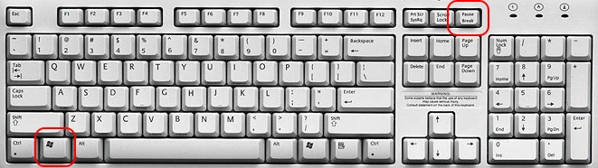
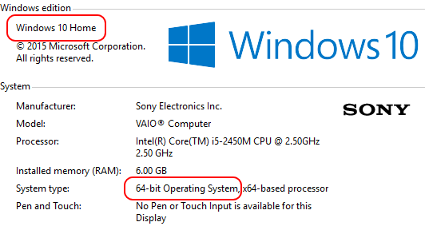

# ¿Cómo sé en cuántos bits trabaja mi windows?

En la página de soporte de Microsoft hay varias explicaciones muy completas en castellano. 
Por ejemplo [https://support.microsoft.com/es-es/kb/827218](https://support.microsoft.com/es-es/kb/827218)

También se puede ver lo que la comunidad de *Stack Overflow* recomienda en: 
[http://superuser.com/search?q=windows+64+bits+or+32+bits](http://superuser.com/search?q=windows+64+bits+or+32+bits)

## Método rápido

Presionar simultáneamente las teclas de windows  e interrumpir 
( ó  según el idioma del teclado)

Aparecerá una ventana con información respecto a la versión del sistema operativo y la cantidad de bits:

